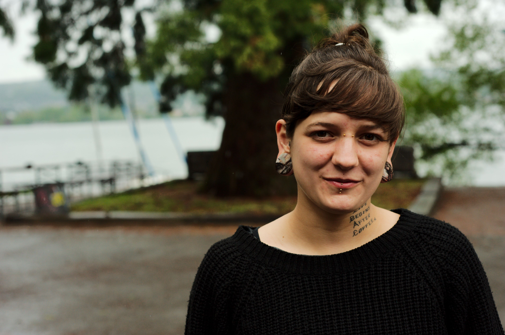
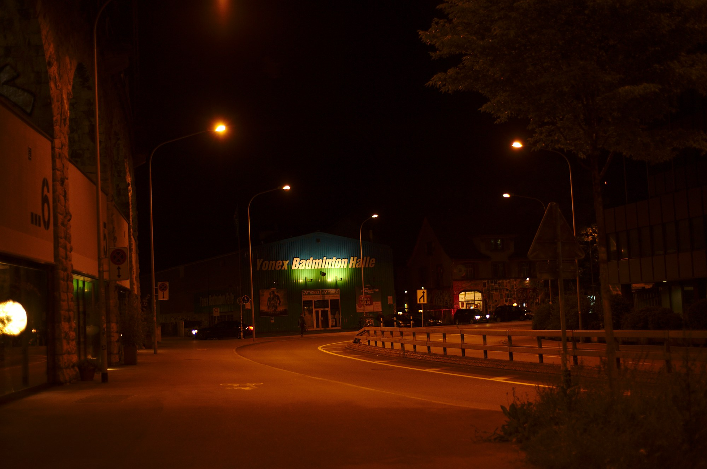
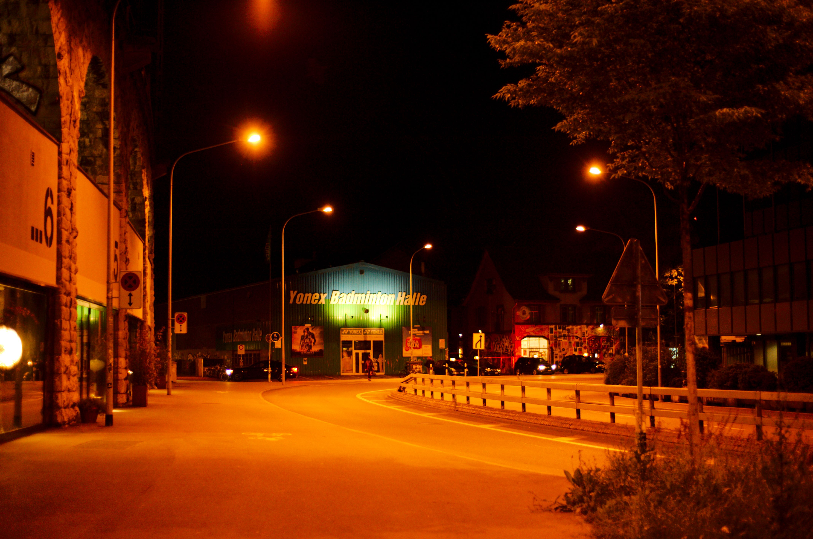

Title: AfterShot Pro 2 im Vergleich mit Darktable unter Linux
Date: 2014-05-21
Tags: bestof, foto, photo, raw, nikon, aftershot, darktable, rawtherapee, linux, debian,  
Category: blog 
Author: janssen

Wie unter Menupunkt [Fotografie](http://aurka.com/pages/fotografie.html) nachlesbar, bearbeite ich meine Fotos, welche mir als Nikon-User im .NEF Format vorliegen, entweder mit [Corel AfterShot Pro](http://aftershotpro.com/) oder mit [Darktable](http://www.darktable.org/). Letzteres möchte ich als überzeugter Linux und FOSS Nutzer eigentlich bevorzugen, es gibt allerdings noch einige Ecken, bei denen AfterShot Pro eindeutig die Nase vorne hat.

Heute hat Corel AfterShot Pro 2 veröffentlicht, welches ich mir nun etwas angeschaut habe. Weil auf meinem 64bit Debian Sid das alte AfterShot Pro nicht lief (Debian hat ab Version 6 auf Multiarch umgestellt und dabei existiert das Paket ia32-libs halt nicht mehr, welches von AfterShot Pro benötigt wird) und ich aktuell keinen Zugriff auf einen Windows oder Mac Rechner habe, musste ich in letzter Zeit für alles aus Darktable zurückgreiffen. Besonders bei Portrait Aufnahmen - oder generell Aufnahmen mit Menschen - zeigte sich Darktable AfterShot Pro deutlich unterlegen. Der zweite, nicht zu übersehende Punkt ist das Rauschverhalten der Bilder. Aufnahmen mit höherem ISO konnten unter AfterShot Pro oftmals ziemlich gut hingerichtet werden. Unter Darktable musste von einer Verwendung leider oftmals abgesehen werden. Ein weiteres Minus für Darktable: Ein normaler JPG Export aus Darktable kann ich nicht in meinem Mediagoblin verwenden. Ich muss das Bild immer zurest mit Gimp öffnen und dann exportieren. Der Ursprung des Problems ist noch nicht bekannt.

Natürlich ist es durchaus möglich, dass ich Darktable falsch oder nicht korrekt bediene. Dies sind jedoch meine Erfahrungen.

# Vergleiche
Lange Rede, kurzer Sinn. Hier einige Vergleiche zwischen Darktable und AfterShot Pro 2.

Verwendet wurden folgende Programmversionen:

* Darktable: 1.4.2-1 (aus den Debian Sid Repositories)
* AfterShot Pro: 2.0.0.133 (64bit Debian Version)

Sämtliche Bilder wurden mit meiner Nikon D3 aufgenommen. Selbstverständlich wurde das selbe ursprüngliche .NEF File verwendet. Ich habe versucht die Fotos möglichst gut hinzubringen, ohne stundenweise am Programm zu sitzen. Optimalerweise möchte ich nur einen Weissabgleich machen und dann den Kontrast noch etwas verändern.

__Beispiel 1__ Portait:

Darktable:

AfterShot Pro 2:

Unter Darktable ist es mir immer sehr schwergefallen, die Hautfarbe nicht 'komisch' aussehen zu lassen. Das habe ich nie wirklich hinbekommen. Dadurch sehen Serien unter Darktable (bei mir) oftmals etwas seltsam aus.

__Beispiel 2__ High ISO by night:

Darktable:

AfterShot Pro 2:

__Beispiel 3__ Objekte bei guten Lichtbedingungen (hier Streetart):

AfterShot Pro 2:

Hier ist der Unterschied zwischen Darktable und AfterShot Pro mit Abstand am geringsten. Obwohl auch hier ein qualitativer Unterschied zu gunsten für AfterShot Pro existiert. Die Farben wirken lebendiger.

# Conclusion
Auch wenn ich bis jetzt erst ein bisschen mit AfterShot Pro2 gespielt habe, steht für mich bereits fest, dass ich mir das Update von AfterShot Pro auf AfterShot Pro 2 leisten werde. Auch wenn ich gerne mit FOSS Software arbeiten würde, habe ich hier nicht nur deutlich mehr Arbeitsaufwand mit Darktable, das Resultat auch oftmals hinter demjenigen von AfterShot Pro hinterher. Darktable habe ich als das leistungsstärkste FOSS-Tool für die RAW-Bearbeitung kennengelernt. Früher hatte ich teilweise [RawTherapee](http://www.rawtherapee.com/) oder mit dem Gimp Plugin [UFRaw](http://ufraw.sourceforge.net/) verwendet. Habe dann jedoch beide aufgrund von schlechteren Resultaten (und bei RawTherapee auch weil es unter Debian teilweise sehr buggy war) bald verworfen und auf AfterShot Pro und Darktable gesetzt.

Dieser kurze Tests zeigt, dass AfterShot Pro 2 durchgehend die besseren Bilder liefert. Die Farben sind leuchtender, mehr lebendig. Das Rauschverhalten ist besser und Portrait kommen eindeutig besser zur Geltung. 

In Zukunft werde ich wohl hauptsächlich auf AfterShot Pro 2 setzen, die Entwicklung von Darktable jedoch weiter im Auge behalten. Eine FOSS-Applikation für die Fotografie einsusetzen wär halt schon was feines. Da AfterShot Pro 2 nun jedoch unter Debian 64bit sauber läuft, hat es Darktable jedoch einen bedeutend schwereren Stand.
