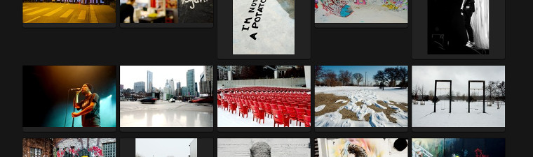

Title: Mediagoblin in use - Ein Bericht
Date: 2014-06-03
Tags: mediagoblin, gnu, goblin, media, hosting, share, photo, film, media
Category: tech
Author: janssen

Seit der [Installation von Mediagoblin auf meinem Uberspace](http://aurka.com/mediagoblin-auf-uberspace.html) ist nun über ein halbes Jahr vergangen - Zeit um ein kurzes Fazit zu ziehen:

Mediagoblin macht sich gut. Die Wartung ist leicht, Updates funktionierten bis jetzt ohne größere Probleme und das Programm machte auch ansonsten keine größeren Probleme. Was bleibt sind (leider; wie so oft) diverse Kinderkrankheiten, welche hoffentlich bald aus der Welt geschafft werden. Bis jetzt habe ich meine Entscheidung, meine Fotos (und es sind bis jetzt effektiv nur Fotos geblieben) auf meiner eigenen Mediagoblin-Instanz zu hosten, nie bereut. Ich habe die volle Kontrolle über meine Fotos, kann Mediagoblin ohne weiter anpassen und muss mir keine Hilfe von bloated Wordrpess Themes oder so holen, die zwar fancy aussehen, aber wohl alleine beim Gedanken auf solch ein Produkt zu bauen, lässt mich erschaudern.

Was zu bemerken ist, die Kinderkrankheiten haben es teilweise in sich. Einige Beispiele:
* JPEGs direkt aus dem RAW-Editor [Darktable](http://www.darktable.org/) exportiert, werden von Mediagoblin korrekt hochgeladen und verarbeitet, können jedoch nicht angezeigt werden. Beispiel gefällig? [Hier](http://mediagoblin.aurka.com/mediagoblin/mg.fcgi/u/janssen/m/boom-1335/) Das Problem scheint ein 'Creation Date'-EXIF Attribut zu sein  ([Bugreport](https://issues.mediagoblin.org/ticket/825)). Ein solches Fotos kann nur direkt auf der Datenbank gelöscht werden, weil das Bild angezeigt werden können muss, um es via WebGUI löschen zu können. Im nächsten Release gibt es dann wenigstens einen `gmg`-Command, um ein Element zu löschen.
* Wird eine Sammlung (Collection im Mediagoblin Jargon) erstellt, wird mit der Hilfe der 'Newer'- und 'Older'-Buttons nicht etwa in dieser Sammlung navigiert, sondern im ganzen Medien-Pool. Um eine Sammlung vollständig zu betrachten, muss also jedes Bild einzeln aus der Sammlungsübersicht angeschaut werden. Auch können Sammlungen nicht sortiert werden. Dies geschieht durch das Upload-Datum automatisch und kann nicht beeinflusst werden.
* Soweit ich das gesehen habe, können keine User erstellt werden, die nur Kommentare, aber keine Medien hochladen können. Ich benötige die Komentarfunktion nicht und würde mich auch nicht freiwillig auf einer Mediagoblin-Instanz anmelden, um einen Komentar abzusetzen, aber die Userbeschränkung auf 'Komentar-only' wär schon nicht schlecht.
* Teilweise funktioniert ein Upload erst beim zweiten Versuch (noch nicht klar, wieso dies teilweise der Fall ist. Kann durchaus auch an meinem Setup liegen)
* Kein Batch-Upload Support (ist geplant; in Entwicklung). Jede Datei muss einzeln hochgeladen werden
* Keine Batch-Modify Funktion (beispielsweise für Tags auf mehrere Bilder)

Obwohl einige dieser Kinderkrankeiten im Vergleich mit anderes Fotoplattformen in der "Cloud" wie [500px](http://500px.com/) oder [Flickr](https://secure.flickr.com/) erheblich sind, werde ich auch in Zukunft weiter auf Mediagoblin bauen. Einerseits weil ich die FOSS Philosophie äusserst unterstützenswert finde und auch weil eine aktive Community (klein aber fein) existiert. Vergleichbare Tools, welche selbst gehostet werden können sind zumeist Closed-Source und kosten oftmals (zumindest bei erweiterter Verwendung). Weiter wurde im Frühjahr 2014 via [Crowdfunding](http://mediagoblin.org/news/campaign-success.html) über 60’000 US$ für das Mediagoblin-Projekt gesammelt. Dabei wurden unter anderem folgende Features verprochen:

* Privates Medien-Sharing (= feinere View-Einstellungsmöglichkeiten)
* Die Möglichkeit über verschiedene Mediagoblin-Instanzen Median zu teilen (via Pump-API)
* Podcast Support
* 1.0 Release (aktuell 0.6.1)
* (ein Feature erkoren aus einem Voting der Crowdfunder_innen)

Ich denke mal, dass wir uns bald auf die Version 0.7 freuen können, auch wenn noch einiges [getan](https://issues.mediagoblin.org/query?status=new&status=in_progress&status=accepted&status=review&group=status&milestone=0.7.0 "Roadmap") getan werden muss.

Alles in allem ist Mediagoblin eine äusserst bedienerfreundliche Medienhosting-Applikation, welche ich allen technisch versierteren Menschen nur wärmstens empfehlen kann. Die Installation wird leider sämtliche technisch nicht versierten Menschen abschrecken, nach der Installation sind die Vorgänge (Upload, Verwaltung, etc.) jedoch äusserst simpel.

Anmerkungen und Korrekturen bitte via [Kontakt](http://aurka.com/pages/about.html)
